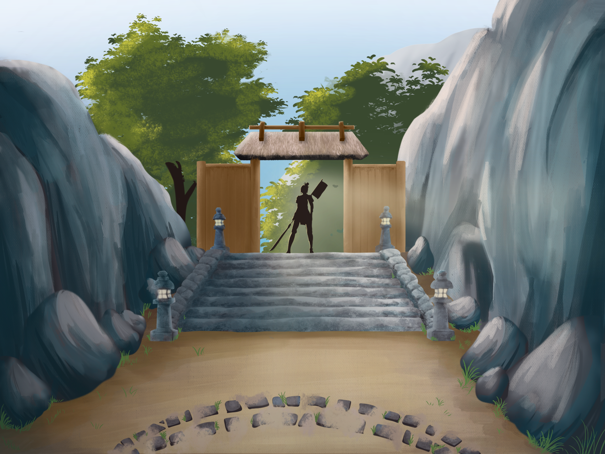

# 🗡️ **Taisaku no Shima**  
**A stylized action-adventure prototype built on Unreal Engine 5**  

## 📜 **Project Description**  
**Taisaku no Shima** is a third-person action-adventure game set in a **fantastical Asian-inspired world**. You play as a forgotten **minor deity** from the Celestial Realm, descending to the troubled island of **Taisaku**, now under attack by **Yōkai**.

With striking visuals inspired by titles like **Genshin Impact** and **Zelda Breath of the Wild**, the game places a strong emphasis on atmosphere and design. Combat, exploration, and quests blend together as you carve your name into the legends of this haunted island.

This is a second version of Taisaku no shima. The first version was a group project and remains a playable prototype. The features added in this new version are developed by [Hugo Flandrin](https://github.com/HugoFlandrin). The goal was to build a satisfying playable game based on the prototype.

## 🧩 **Main Features**

1. **Stylized Third-Person Gameplay**  
   - Explore a richly detailed island from a **third-person perspective**.  
   - Discover ancient shrines, corrupted forests, and hidden paths — all shaped by a distinctive **cel-shaded aesthetic**.

2. **Action-Oriented Combat System**  
   - Engage in combat against **mystical Yōkai**, combining melee attacks and special powers.  
   - Use fluid character controls and animations to dodge, strike, and survive.

3. **Quest and Narrative System**  
   - Interact with villagers, divine spirits, and remnants of the past.  
   - Complete quests to uncover your **forgotten identity** and earn your place in the heavens.

## 🚀 **Installation and Setup**

⚠️ **Taisaku no Shima is a non-commercial prototype and is not publicly available.** ⚠️  
This project was created for educational purposes only.

## 🛠️ **Technologies Used**  
- **Engine**: Unreal Engine 5  
- **Languages**: Blueprint / C++ (Unreal)

## 🧑‍💻 **Authors**  
Developed as part of a creative team project at **Ynov Lyon**.  
(Current team only — Year 2 contributors)  
   - [Bruno Wolff-Dumontel](https://github.com/BrunoWOLFF-Ynov) — Developer & Project manager
   - [Hugo Flandrin](https://github.com/HugoFlandrin) — Developer  
   - [Alexis Borteyru](https://github.com/Wawax007) — Developer  
   - [Victor Florent](https://github.com/Gameplushy) — Developer 
   - Julien Fosse — 3D Artist  
   - Luc Fanget — 3D Artist  
   - Samuel Hebrard — 3D Artist  
   - Evan Jacquier — 3D Artist

### 🌸 **Will the gods remember your name?**  